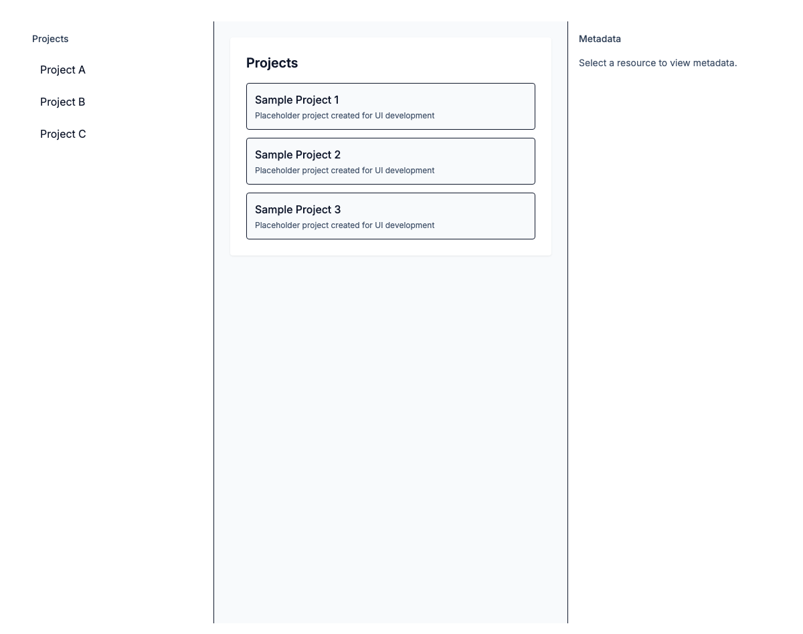
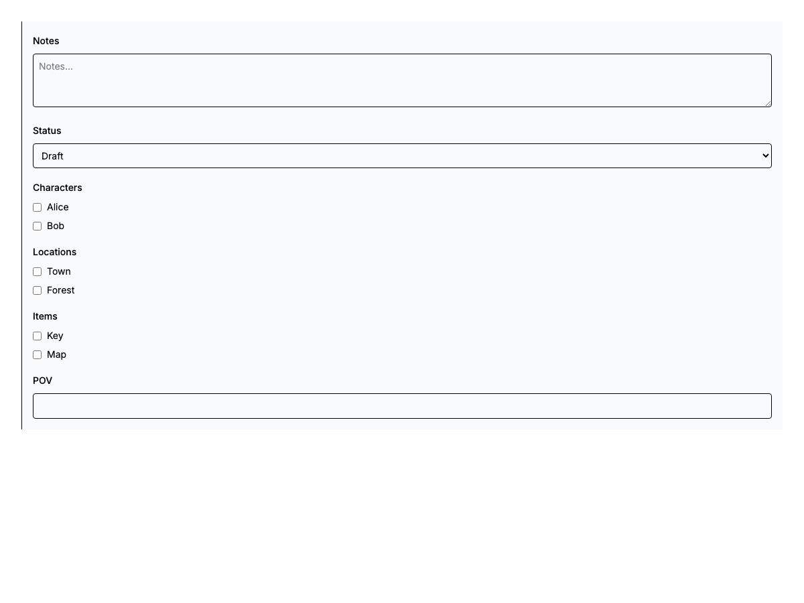
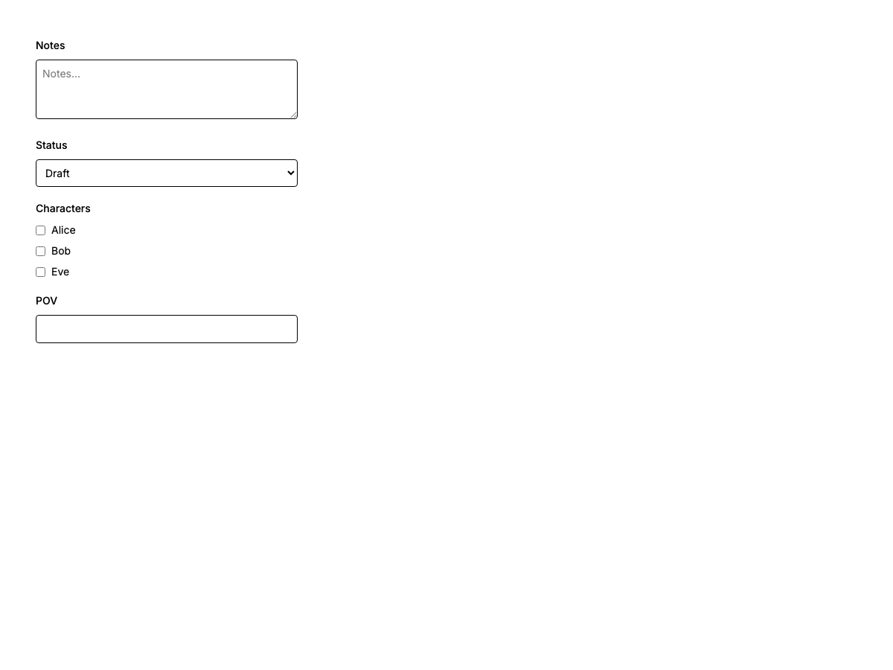
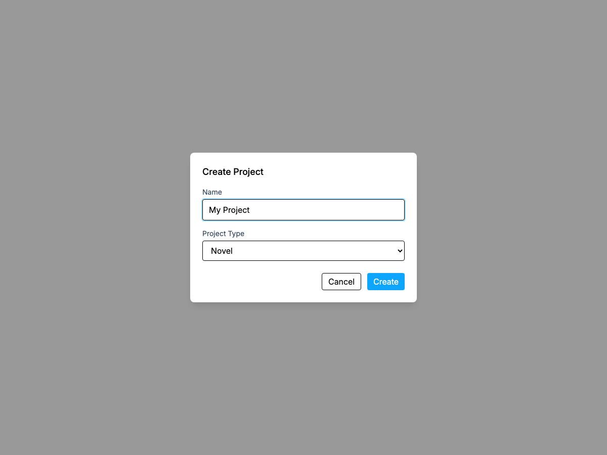
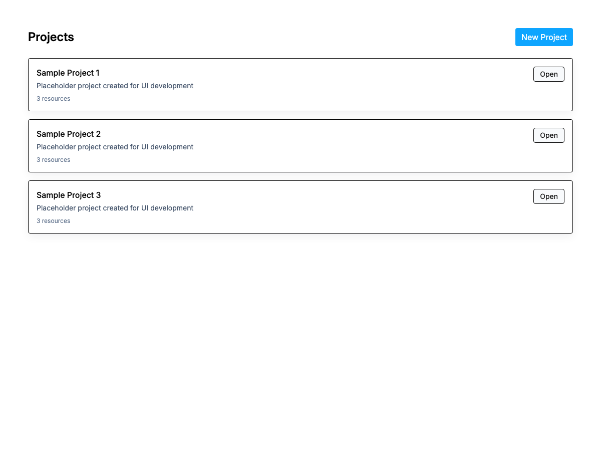

# Draft PR: feat(ui): scaffold GetWrite UI skeleton

## Summary

This PR introduces the GetWrite UI scaffold: a Next.js + TypeScript app under `frontend/` with Storybook stories, unit tests (Vitest), and Playwright E2E tests. The goal is to provide a polished skeleton for UI development and QA.

## Key changes

- Add global layout and AppShell with Resource Tree, Work Area, and Metadata Sidebar
- Implement StartPage and project management modals
- Implement ResourceTree and ResourceContextMenu with outside-click handling
- Implement WorkArea views (Edit, Organizer, Data, Diff, Timeline) and ViewSwitcher
- Add Storybook stories for components and play() interaction tests
- Add Vitest unit tests and Playwright E2E tests; Playwright artifacts are stored at `frontend/playwright-report/`
- Add Tailwind tokens and global styles

## How to run locally

Install dependencies and run Storybook:

```bash
cd frontend
pnpm install
pnpm run storybook
```

Run unit tests:

```bash
pnpm test
```

Run Storybook tests:

```bash
pnpm run test-storybook
```

Run Playwright E2E (requires Storybook to be served or adjust `webServer` config):

```bash
pnpm exec playwright test
```

## Storybook links

- Local static build: `frontend/storybook-static/index.html`
- Story files: `stories/` (see `stories/` directory)

## Screenshots

The following screenshots were captured from the Storybook static build and are included in this branch under `specs/001-ui-getwrite-skeleton/screenshots/`:

- AppShell: 
- Metadata Sidebar: 
- Sidebar Controls: 
- Create Project Modal (open): 
- Manage Project Menu: 
- Start Page: 

(If you'd like higher-resolution or additional screen captures, run the capture script at `specs/001-ui-getwrite-skeleton/scripts/capture-storybook-screenshots.js` against a local Storybook server.)

## Testing notes

- Unit tests cover core components; see `frontend/tests/` for specifics
- Storybook play() tests exercise interactive flows for critical UI pieces
- E2E tests are in `e2e/` and produce artifacts to `frontend/playwright-report/`

## Checklist

Please confirm the PR checklist in `specs/001-ui-getwrite-skeleton/PR_CHECKLIST.md` before requesting review.

---

_Drafted by automation — fill screenshots and final PR title before opening._
